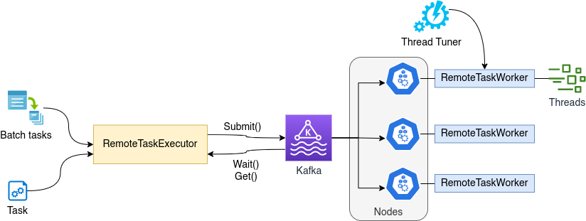
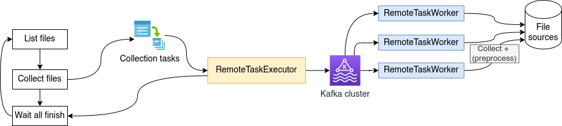

# Kafka Task Executor

kafka-taskexecutor is a Java-based [task executor](https://docs.spring.io/spring-framework/reference/integration/scheduling.html) on Kafka.

## Key features
* Highly scalable; tasks are distributed to Kafka nodes, inheriting Kafka's scalability
* High-performance
   - Tasks are executed in parallel across nodes and CPUs
   - Automated tuning of the number of threads on each node based on the actual machine usage
* Flexible
   - MapReduce and embarrassingly parallel scenarios can be easily implemented
   - Custom functionalities for TaskWorker by implementing the WorkerFunction interface

## Usage
You need [Java SDK](https://www.oracle.com/uk/java/technologies/java-se-glance.html) and [Maven](https://maven.apache.org/) to compile. All dependencies will be resolved automatically.

If you are new to Maven, [this guide](https://maven.apache.org/guides/getting-started/maven-in-five-minutes.html) will be useful.

See [the example](src/main/java/com/tritronik/kafka/test/TaskExecutorTest.java) to get started.

## License
[Apache License 2.0](https://www.apache.org/licenses/LICENSE-2.0)

## Contributions

Everyone is welcome to contribute (see [license](/LICENSE)). The current maintainer is [agung-m](https://github.com/agung-m)

Bugs and suggestions should be reported in [issues](https://github.com/agung-m/kafka-taskexecutor/issues)

## Architecture

## Use cases

### Parallel file collector

